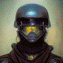
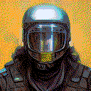

## Punks

 
punk_01.png

 
punk_02.png

 
punk_03.png

 
punk_04.png

 
punk_05.png

 
punk_06.png

 
punk_07.png

 
punk_08.png

 
punk_09.png

 
punk_10.png

 
punk_11.png

 
punk_12.png

 
punk_13.png

 
punk_14.png

 
punk_15.png

 
punk_16.png

 
punk_17.png

 
punk_18.png

 
punk_19.png

 
punk_20.png

 
punk_21.png

 
punk_22.png

 
punk_23.png

 
punk_24.png

 
punk_25.png

 
punk_26.png

 
punk_27.png

 
punk_28.png

 
punk_29.png

 
punk_30.png

 
punk_31.png

 
punk_32.png

 
punk_33.png

 
punk_34.png

 
punk_35.png

 
punk_36.png

 
punk_37.png

 
punk_38.png

 
punk_39.png

 
punk_40.png

 
punk_41.png

 
punk_42.png

 
punk_43.png

 
punk_44.png

 
punk_45.png

 
punk_46.png

 
punk_47.png

## Corpos

 
corpo_01.png

 
corpo_02.png

 
corpo_03.png

 
corpo_04.png

 
corpo_05.png

 
corpo_06.png

 
corpo_07.png

 
corpo_08.png

 
corpo_09.png

 
corpo_10.png

 
corpo_11.png

 
corpo_12.png

 
corpo_13.png

 
corpo_14.png

 
corpo_15.png

 
corpo_16.png

## Secops

 
secop_01.png

 
secop_02.png

 
secop_03.png

 
secop_04.png

 
secop_05.png

 
secop_06.png

 
secop_07.png

 
secop_08.png

 
secop_09.png

 
secop_10.png

 
secop_11.png

 
secop_12.png

